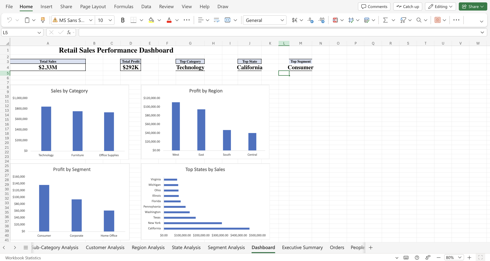
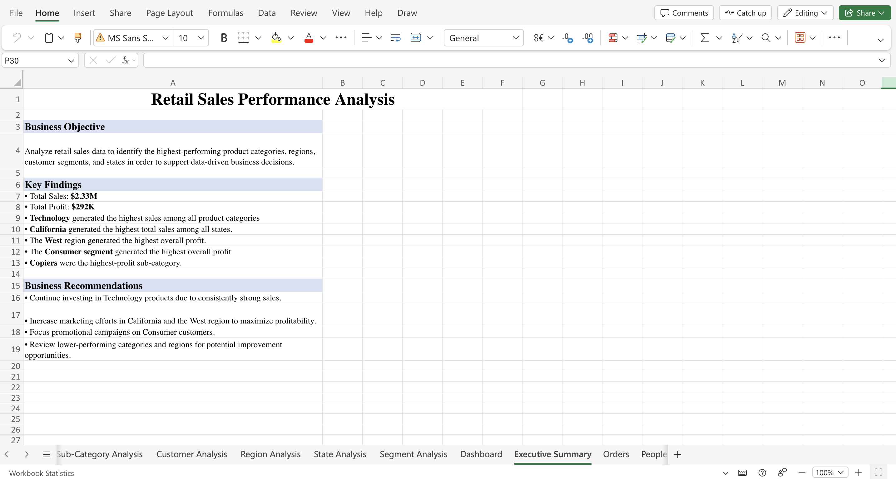

# Retail_Sales_Performance_Analysis
Business Analyst project analyzing retail sales using Excel PivotTables, dashboards, and executive reporting.
Retail Sales Performance Analysis

## Overview

This project analyzes retail sales data using Microsoft Excel to identify sales trends, top-performing product categories, customer segments, and geographic regions. The analysis includes PivotTables, Pivot Charts, an interactive dashboard, and an executive summary designed to support business decision-making.

## Dashboard

The dashboard provides executives with a high-level view of sales performance, profitability, top-performing categories, regions, customer segments, and states through interactive PivotTables and PivotCharts.

## Executive Summary

This executive summary gives a quick overview of the main findings from the sales analysis, including the key insights and recommendations based on the data.

## Business Questions Answered

- Which product category generated the highest sales?
- Which customer segment generated the highest profit?
- Which state generated the highest sales?
- Which region generated the highest profit?
- Which sub-category generated the highest profit?

## Key Findings

- **Total Sales:** $2.33M
- **Total Profit:** $292K
- Technology generated the highest sales among all categories.
- California generated the highest total sales.
- The West region generated the highest overall profit.
- Consumer generated the highest overall profit among customer segments.
- Copiers were the highest-profit sub-category.

## Business Recommendations

- Continue investing in Technology products due to consistently strong sales.
- Increase marketing efforts in California and the West region to maximize profitability.
- Focus promotional campaigns on Consumer customers.
- Review lower-performing categories and regions for improvement opportunities.

## Tools Used

- Microsoft Excel
- Pivot Tables
- Pivot Charts
- Dashboard Design
- Data Analysis
- Business Analysis
